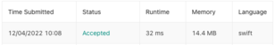
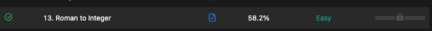
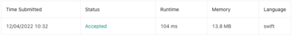
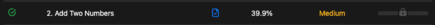
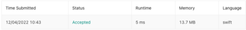
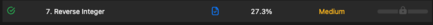

# fifth-week-homework

## 1- Breaking Bad api uygulamamıza persistant özelliği kazandıracağız.

#### Uygulamaya ekleyeceğimiz persistant özelliğini hafta 4' e ekledim. [Buraya](https://github.com/Vakifbank-IOS-Swift-Patika-Bootcamp/fourth-week-homework-MehmetBicici) tıklayarak 4. haftaya gidebilirsiniz. 

### 2- Clean Code - 5, 6, 7, 8 chapterlar özetlenmelidir.

### 3- Crack the Interviews - 1, 2, 3 Çalışılacak.
 
### 4- Leet Code üzerinden seçilmiş 3 soru çözülecek ve soruya ait görseller repoya eklenecek. 

